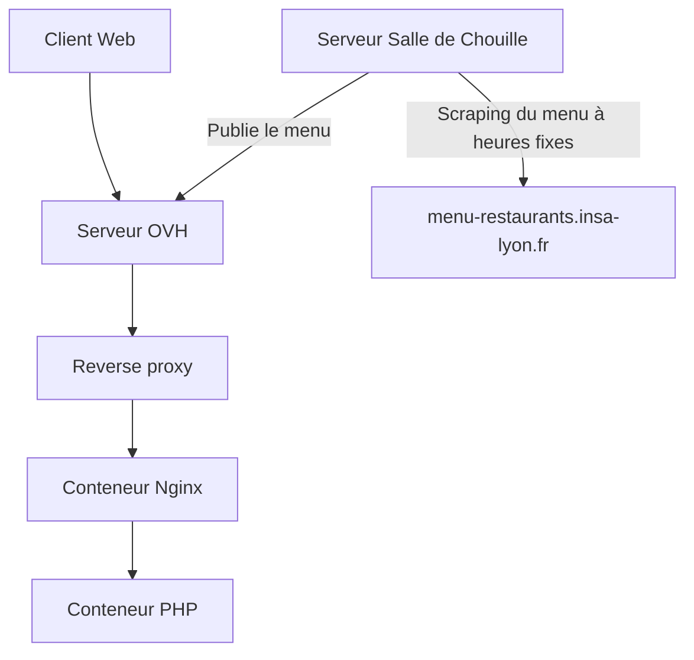

> INSA Utils a été repris par le BdE INSA Lyon et est désormais hébergé par le [SIA INSA Lyon](https://sia.asso-insa-lyon.fr/) à l’adresse [utils.bde-insa-lyon.fr](https://utils.bde-insa-lyon.fr). Le code source est maintenant disponible à l’adresse [gitlab.com/sia-insa-lyon/BdEINSALyon/insa-utils](https://gitlab.com/sia-insa-lyon/BdEINSALyon/insa-utils)

# INSA Utils

INSA Utils, ou Utilitaires INSA est un site internet (initialement insa-utils.fr, puis [utils.bde-insa-lyon.fr](https://utils.bde-insa-lyon.fr) après
sa reprise par le BdE INSA Lyon) proposant divers services destinés à faciliter notre vie en tant qu'étudiants à l'INSA Lyon.

Le site est développé en PHP vanilla, et utilise du VueJS pour certaines pages frontend. Meilisearch est aussi utilisé pour Link'INSA.

Un service d’authentification sans mot de passe est utilisé à l’échelle du site internet. L’authentification se fait via un code ou lien envoyé à une
adresse mail INSA, garantissant que seuls les étudiants INSA Lyon ont accès aux services sous authentification.

# Services associés

## INS'Agenda

INS'Agenda est un agenda collaboratif permettant aux étudiants d’un groupe classes de partager une todo list commune.
Il suffit qu'un membre de la classe ajoute des tâches, puis tout le monde y aura accès.
Après authentification, Il est possible de demander à rejoindre une classe, ou de créer une nouvelle classe.
Chaque membre d'une classe peut accepter ou refuser les demandes.

## INS'Appétit

INS'Appétit permet d'accéder aux menus des restaurants INSA sans avoir à passer par une interface non adaptée nécessitant l'utilisation du VPN INSA.

Le service INS'Appétit s'occupe automatiquement de récupérer les données des menus du RI et de l'Olivier, historiquement via une connexion VPN, et
maintenant via le repository "
INSA Utils Menu Fetcher" déployé sur un serveur du réseau INSA, faisant une requete au serveur INSA Utils principal.

## Rest'INSA

Calculateur de points restaurants INSA en saisissant son solde et en cochant chacun des jours où l'on compte manger au restaurant INSA. Le solde à la
fin du mois est ainsi calculé automatiquement et il vous est indiqué le nombre de fois que vous pouvez doubler.
Frontend VueJS.

## Link'INSA

Partage collaboratif de liens utiles à la vie à l'INSA. Chacun peut ajouter des liens, et évaluer la pertinence des liens des autres. Un moteur de
recherche utilisant meilisearch permet de retrouver rapidement n'importe quel lien.

## Cal'INSA

Convertisseur d'abonnement ICal ADE, en générant un nouveau lien d'abonnement ICal. À chaque requête sur ce lien, Cal'INSA fait la requête auprès d'
ADE et transforme la syntaxe verbeuse d'ADE en une syntaxe plus simple à lire.
Cal'INSA vous sera certainement utile si vous utilisez un client de calendrier personnel (au lieu de INKK).
Cal'INSA est entierrement configurable dans le fichier `cal-config.yml`.

# Architecture

# Run on Docker

Simply run `docker-compose -f local-compose.yaml up -d`.

The configuration can be customized in `local-compose.yaml` if you want to use a different database, change ports or configure a SMTP server.

